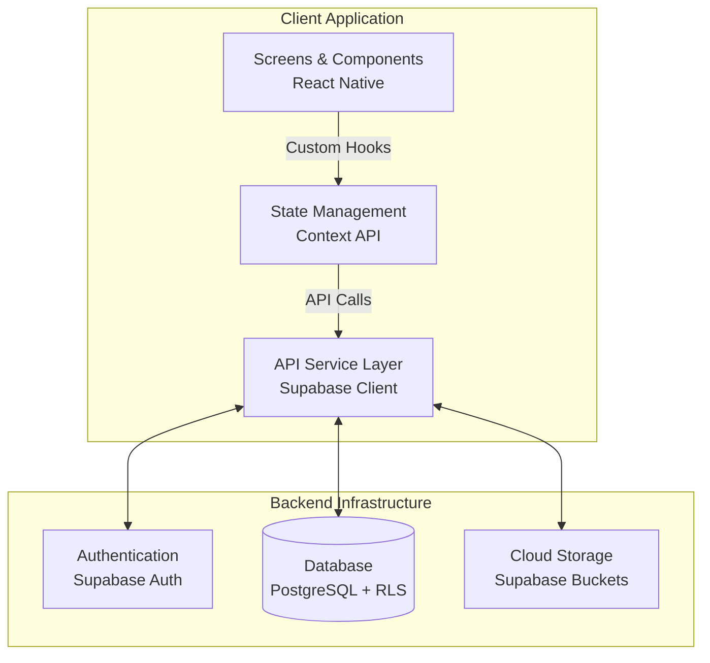

# Home Inventory & Warranty Tracker


**A modern cross-platform mobile application to effortlessly manage your household assets and track product warranties.**

The Home Inventory & Warranty Tracker solves the common problem of losing purchase receipts, forgetting warranty expiration dates, and struggling to organize home assets. Its main purpose is to provide users with a secure, centralized digital vault for logging product details, storing invoices, and managing periodic maintenance schedules.

---

## Features

- **Secure Authentication & Access Control:**
  - Email/Password registration and login powered by Supabase Auth.
  - Local Biometric App Lock (FaceID/TouchID) for enhanced privacy on the device.
- **Comprehensive Product Management (CRUD):**
  - Add, edit, view, and delete household products and appliances.
  - Organize items using predefined categories and mark important ones as favorites.
- **Warranty & Maintenance Tracking:**
  - Automated tracking of warranty periods with visual expiration indicators.
  - Log and schedule periodic maintenance records, tracking associated costs and service providers.
- **Media & Document Storage:**
  - Capture or upload product photos and invoice documents directly to cloud storage.
- **Advanced Search & Filtering:**
  - Full-text search capability across product names, brands, models, and serial numbers.
- **Local Push Notifications:**
  - Automated local notifications alerting users of upcoming warranty expirations or scheduled maintenance.
- **User Experience Enhancements:**
  - Seamless Dark/Light mode switching with smooth animated transitions.
  - Multi-language support via internal i18n implementation.
  - Interactive dashboard charts for inventory statistics.
  - Data export and share functionalities (PDF/Print).

---

## Tech Stack

### Frontend / Mobile
| Technology | Purpose |
|---|---|
| **React Native** (0.86) | Core framework for building the cross-platform mobile application. |
| **Expo** (v57) | Managed workflow providing native APIs (Camera, FileSystem) and OTA updates. |
| **TypeScript** | Enforces static typing for robustness and better developer experience. |

### Backend & Database
| Technology | Purpose |
|---|---|
| **Supabase** | Backend-as-a-Service (BaaS) providing authentication and APIs. |
| **PostgreSQL** | Relational database secured with Row Level Security (RLS) policies. |

### State Management & Architecture
| Technology | Purpose |
|---|---|
| **React Context API** | Handles global application state (Auth, Theme, Inventory, Alerts). |
| **React Hook Form** | Manages complex form states with optimized re-renders. |
| **Zod** | Provides strict schema validation for form payloads. |

### Storage & Native APIs
| Technology | Purpose |
|---|---|
| **Supabase Storage** | Cloud buckets for storing uploaded `product-images` and `invoices`. |
| **Expo Modules** | Used for local notifications, biometric auth, image/document picking, and sharing. |

---

## Architecture

The application adopts a **Layered Architecture** leveraging the **Context API** for state management and a **Service Layer** for backend abstraction. This design ensures separation of concerns, keeping the UI components clean and decoupled from data-fetching logic.

- **UI Layer (`src/screens`, `src/components`):** Composed of React Native views. Feature-based file grouping is used, where each screen has its own `.tsx` and `.styles.ts` files.
- **State Management Layer (`src/context`):** Context Providers (e.g., `AuthProvider`, `InventoryContext`) wrap the application, maintaining global states and exposing custom hooks (`useAuth`, `useInventory`) for the UI to consume.
- **Service Layer (`src/api`):** Abstracts all Supabase SDK interactions. Services like `productService.ts` and `authService.ts` handle data serialization, error formatting, and API requests.
- **Data & Security Layer (Supabase):** PostgreSQL handles data relations, while Row Level Security (RLS) policies ensure users can only access and modify their own inventory data.



---

## Getting Started

Follow these steps to set up the project locally.

### Prerequisites
- [Node.js](https://nodejs.org/) (v18 or newer recommended)
- [npm](https://www.npmjs.com/) or [yarn](https://yarnpkg.com/)
- [Expo CLI](https://docs.expo.dev/get-started/installation/)
- A [Supabase](https://supabase.com/) account and project.

### Installation

1. **Clone the repository:**
   ```bash
   git clone https://github.com/omercnkc/envanterTakip.git
   cd envanterTakip
   ```

2. **Install dependencies:**
   ```bash
   npm install
   ```

3. **Environment Setup:**
   Create a `.env` file in the root directory based on `.env.example`:
   ```bash
   cp .env.example .env
   ```
   Populate the variables with your Supabase project credentials:
   ```env
   EXPO_PUBLIC_SUPABASE_URL=https://your-project-id.supabase.co
   EXPO_PUBLIC_SUPABASE_ANON_KEY=your-anon-key
   EXPO_PUBLIC_DEMO_MODE=false
   ```

4. **Database Setup:**
   Run the SQL scripts located in the `database/` directory (e.g., `schema.sql`) in your Supabase SQL Editor to set up the required tables, triggers, and Row Level Security (RLS) policies.

5. **Run the Application:**
   ```bash
   npx expo start
   ```
   Press `a` to run on an Android emulator, `i` for iOS simulator, or scan the QR code with the Expo Go app on your physical device.

---

## License
This project is licensed under the MIT License - see the [LICENSE](./LICENSE) file for details.

## Contact
For any questions or feedback, please reach out via GitHub Issues or contact the repository owner.
